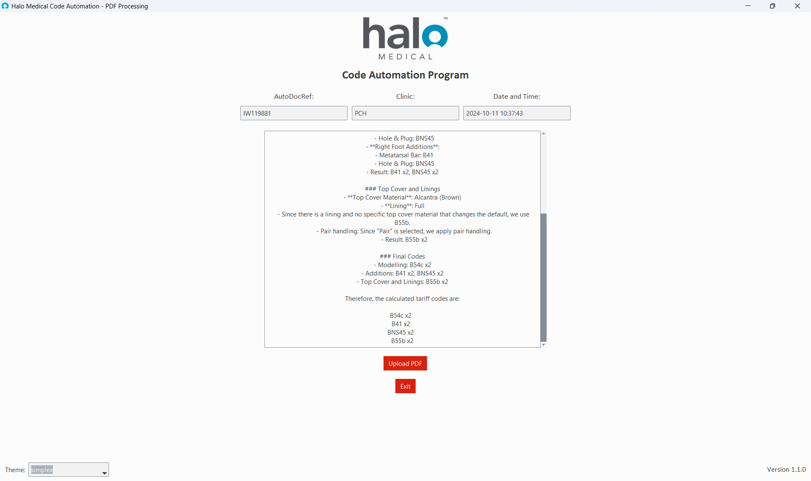

# Halo Medical Code Automation

    

## Overview
**Halo-AI-Coder** is an internal tool developed for the price coding department at Halo Medical. It leverages advanced AI and cloud-based services to automate the price coding of prescription forms in alignment with NHS recommendations. The project integrates with various APIs to streamline the price coding process, significantly reducing time and errors compared to manual methods.

The application uses a custom document reader from the **Azure Document Intelligence API** to automatically extract data from PDF forms, which is then sent to an **OpenAI model**. The AI model processes the extracted data, applying logic to determine the appropriate price codes with accuracy levels that exceed those of human price coders. The entire process is highly efficient, taking approximately **5 seconds** from document upload to price code output.

## Tools
- **Python 3.12**: The core programming language used for the application.
- **Azure Document Intelligence API**: This API is used for reading and interpreting the PDF forms, converting the document content into structured text data.
- **OpenAI API (gpt_4o_08_05)**: The AI model processes the extracted text, applying custom logic defined in prompt files to price code the data accurately.

## Features

    

- **Upload PDFs**: Users can upload PDF forms directly into the application, allowing the system to read and process multiple documents seamlessly.
- **Drag and Drop PDFs**: To increase productivity, users can drag and drop PDF files directly into the interface, speeding up the workflow and reducing time spent navigating file directories.
- **Theme Switching**: Offers multiple theme options to improve accessibility, allowing users to choose between light and dark themes or other custom styles for better visibility and comfort during long sessions.
- **Automated Data Extraction**: Utilises a custom form reader from Azure Document Intelligence to automatically extract relevant information from prescription forms. This process eliminates the need for manual data entry and ensures consistency.
- **AI-Powered Price Coding**: The extracted data is sent directly to the OpenAI model, which applies a predefined logic to assign accurate price codes based on NHS guidelines. This model is tailored to handle the nuances of medical coding and provides a consistent output.
- **Fast Processing Time**: The entire extraction and price coding process takes about **5 seconds**, allowing the department to handle a high volume of forms efficiently.
- **Results Logging**: Every API call, including the extracted data and the resulting price codes, is recorded in a **results log**. A new log file is generated each day, making it easier to organise and review past results, monitor accuracy, and track any discrepancies.

## Supported Form Types
- **Insole Forms**: The initial version of Halo-AI-Coder focuses on processing insole-related prescription forms, with the potential for expansion to other form types in the future.

## Prerequisites
- **Python 3.12** installed on your system (this is not required for users who use the standalone executable version of the application).
- **Access to the Azure Document Intelligence API**: Required to enable the custom document reader functionality.
- **API key for OpenAI's gpt_4o_08_05**: Necessary for secure communication with the OpenAI model to perform price coding.
